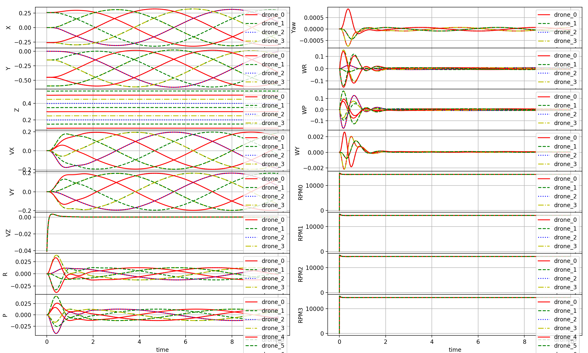
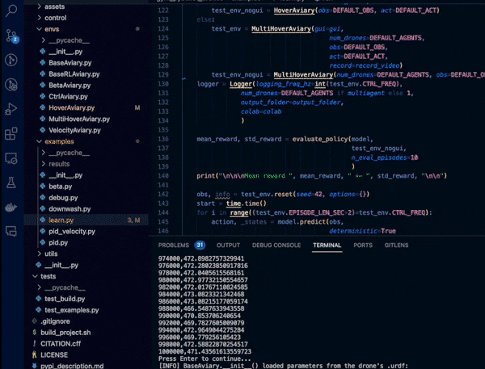
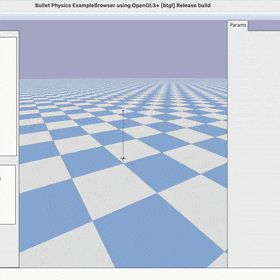

# IMPORTANT NOTE:
This repository's default/`master` branch is the final update of the originally published `paper` branch.
For the currently developed and maintained version of `gym-pybullet-drones` (using [`gymnasium`](https://gymnasium.farama.org) and [`stable-baselines3`](https://stable-baselines3.readthedocs.io/en/master/guide/algos.html) 2.0), please checkout the branch named `main`:
```sh
git clone -b main https://github.com/utiasDSL/gym-pybullet-drones.git
```
Please `git pull` frequently and feel free to open new [issues](https://github.com/utiasDSL/gym-pybullet-drones/issues) for any undesired, unexpected, or (presumably) incorrect behavior. Thanks 🙏

# gym-pybullet-drones

This is a minimalist refactoring of the original `gym-pybullet-drones` repository, designed for compatibility with [`gymnasium`](https://github.com/Farama-Foundation/Gymnasium), [`stable-baselines3` 2.0](https://github.com/DLR-RM/stable-baselines3/pull/1327), and SITL [`betaflight`](https://github.com/betaflight/betaflight)/[`crazyflie-firmware`](https://github.com/bitcraze/crazyflie-firmware/).

<<<<<<< HEAD
- If you are interested in safe control and the companion code of ["Safe Learning in Robotics"](https://www.annualreviews.org/doi/abs/10.1146/annurev-control-042920-020211) and ["Safe Control Gym"](https://ieeexplore.ieee.org/abstract/document/9849119/), check out [`safe-control-gym`](https://github.com/utiasDSL/safe-control-gym)
=======
> **NOTE**: if you prefer to access the original codebase, presented at IROS in 2021, please `git checkout [paper|master]` after cloning the repo, and refer to the corresponding `README.md`'s.
>>>>>>> 50d1a958def27121bcf63f3cc753049fee8e71e5

 

## Installation

Tested on Intel x64/Ubuntu 22.04 and Apple Silicon/macOS 14.1.

```sh
git clone https://github.com/utiasDSL/gym-pybullet-drones.git
cd gym-pybullet-drones/

conda create -n drones python=3.10
conda activate drones

pip3 install --upgrade pip
pip3 install -e . # if needed, `sudo apt install build-essential` to install `gcc` and build `pybullet`

```

## Use

### PID control examples

```sh
cd gym_pybullet_drones/examples/
python3 pid.py # position and velocity reference
python3 pid_velocity.py # desired velocity reference
```

### Downwash effect example

```sh
cd gym_pybullet_drones/examples/
python3 downwash.py
```

### Reinforcement learning examples (SB3's PPO)

```sh
cd gym_pybullet_drones/examples/
python learn.py # task: single drone hover at z == 1.0
python learn.py --multiagent true # task: 2-drone hover at z == 1.2 and 0.7
```

 

### utiasDSL `pycffirmware` Python Bindings example (multiplatform, single-drone)

Install [`pycffirmware`](https://github.com/utiasDSL/pycffirmware?tab=readme-ov-file#installation) for Ubuntu, macOS, or Windows

```sh
cd gym_pybullet_drones/examples/
python3 cff-dsl.py
```

### Betaflight SITL example (Ubuntu only)

```sh
git clone https://github.com/betaflight/betaflight # use the `master` branch at the time of writing (future release 4.5)
cd betaflight/ 
make arm_sdk_install # if needed, `apt install curl``
make TARGET=SITL # comment out line: https://github.com/betaflight/betaflight/blob/master/src/main/main.c#L52
cp ~/gym-pybullet-drones/gym_pybullet_drones/assets/eeprom.bin ~/betaflight/ # assuming both gym-pybullet-drones/ and betaflight/ were cloned in ~/
betaflight/obj/main/betaflight_SITL.elf
```

In another terminal, run the example

```sh
conda activate drones
cd gym_pybullet_drones/examples/
python3 beta.py --num_drones 1 # check the steps in the file's docstrings to use multiple drones
```

<<<<<<< HEAD
Run the [replay script](https://github.com/utiasDSL/gym-pybullet-drones/blob/master/experiments/learning/test_singleagent.py) to visualize the best trained agent(s) as

```bash
$ python3 test_singleagent.py --exp ./results/save-<env>-<algo>-<obs>-<act>-<time-date>
```

For multi-agent RL problems, using [`rllib`](https://docs.ray.io/en/master/rllib.html) run the [train script](https://github.com/utiasDSL/gym-pybullet-drones/blob/master/experiments/learning/multiagent.py) as

```bash
$ cd gym-pybullet-drones/experiments/learning/
$ python3 multiagent.py --num_drones <num_drones> --env <env> --obs <ObservationType> --act <ActionType> --algo <alg> --workers <num_workers>
```

Run the [replay script](https://github.com/utiasDSL/gym-pybullet-drones/blob/master/experiments/learning/test_multiagent.py) to visualize the best trained agent(s) as

```bash
$ python3 test_multiagent.py --exp ./results/save-<env>-<num_drones>-<algo>-<obs>-<act>-<date>
```

## Class `BaseAviary`

A flight arena for one (ore more) quadrotor can be created as a subclass of `BaseAviary()`

```python
>>> env = BaseAviary( 
>>>       drone_model=DroneModel.CF2X,      # See DroneModel Enum class for other quadcopter models 
>>>       num_drones=1,                     # Number of drones 
>>>       neighbourhood_radius=np.inf,      # Distance at which drones are considered neighbors, only used for multiple drones 
>>>       initial_xyzs=None,                # Initial XYZ positions of the drones
>>>       initial_rpys=None,                # Initial roll, pitch, and yaw of the drones in radians 
>>>       physics: Physics=Physics.PYB,     # Choice of (PyBullet) physics implementation 
>>>       freq=240,                         # Stepping frequency of the simulation
>>>       aggregate_phy_steps=1,            # Number of physics updates within each call to BaseAviary.step()
>>>       gui=True,                         # Whether to display PyBullet's GUI, only use this for debbuging
>>>       record=False,                     # Whether to save a .mp4 video (if gui=True) or .png frames (if gui=False) in gym-pybullet-drones/files/, see script /files/videos/ffmpeg_png2mp4.sh for encoding
>>>       obstacles=False,                  # Whether to add obstacles to the environment
>>>       user_debug_gui=True)              # Whether to use addUserDebugLine and addUserDebugParameter calls (it can slow down the GUI)
````

And instantiated with `gym.make()`—see [`learn.py`](https://github.com/utiasDSL/gym-pybullet-drones/blob/master/examples/learn.py) for an example

```python
>>> env = gym.make('rl-takeoff-aviary-v0')  # See learn.py
```

Then, the environment can be stepped with

```python
>>> obs = env.reset()
>>> for _ in range(10*240):
>>>     obs, reward, done, info = env.step(env.action_space.sample())
>>>     env.render()
>>>     if done: obs = env.reset()
>>> env.close()
```

### Creating New Aviaries

A new RL problem can be created as a subclass of [`BaseAviary`](https://github.com/utiasDSL/gym-pybullet-drones/blob/master/gym_pybullet_drones/envs/BaseAviary.py) (i.e. `class NewAviary(BaseAviary): ...`) and implementing the following 7 abstract methods

```python
>>> #### 1
>>> def _actionSpace(self):
>>>     # e.g. return spaces.Box(low=np.zeros(4), high=np.ones(4), dtype=np.float32)
>>> #### 2
>>> def _observationSpace(self):
>>>     # e.g. return spaces.Box(low=np.zeros(20), high=np.ones(20), dtype=np.float32)
>>> #### 3
>>> def _computeObs(self):
>>>     # e.g. return self._getDroneStateVector(0)
>>> #### 4
>>> def _preprocessAction(self, action):
>>>     # e.g. return np.clip(action, 0, 1)
>>> #### 5
>>> def _computeReward(self):
>>>     # e.g. return -1
>>> #### 6
>>> def _computeDone(self):
>>>     # e.g. return False
>>> #### 7
>>> def _computeInfo(self):
>>>     # e.g. return {"answer": 42}        # Calculated by the Deep Thought supercomputer in 7.5M years
```

See [`CtrlAviary`](https://github.com/utiasDSL/gym-pybullet-drones/blob/master/gym_pybullet_drones/envs/CtrlAviary.py), [`VisionAviary`](https://github.com/utiasDSL/gym-pybullet-drones/blob/master/gym_pybullet_drones/envs/VisionAviary.py), [`HoverAviary`](https://github.com/utiasDSL/gym-pybullet-drones/blob/master/gym_pybullet_drones/envs/single_agent_rl/HoverAviary.py), and [`FlockAviary`](https://github.com/utiasDSL/gym-pybullet-drones/blob/master/gym_pybullet_drones/envs/multi_agent_rl/FlockAviary.py) for examples

### Action Spaces Examples

The action space's definition of an environment must be implemented in each subclass of [`BaseAviary`](https://github.com/utiasDSL/gym-pybullet-drones/blob/master/gym_pybullet_drones/envs/BaseAviary.py) by function

```python
>>> def _actionSpace(self):
>>>     ...
```

In [`CtrlAviary`](https://github.com/utiasDSL/gym-pybullet-drones/blob/master/gym_pybullet_drones/envs/CtrlAviary.py) and [`VisionAviary`](https://github.com/utiasDSL/gym-pybullet-drones/blob/master/gym_pybullet_drones/envs/VisionAviary.py), it is a [`Dict()`](https://github.com/openai/gym/blob/master/gym/spaces/dict.py) of [`Box(4,)`](https://github.com/openai/gym/blob/master/gym/spaces/box.py) containing the drones' commanded RPMs

The dictionary's keys are `"0"`, `"1"`, .., `"n"`—where `n` is the number of drones

Each subclass of [`BaseAviary`](https://github.com/utiasDSL/gym-pybullet-drones/blob/master/gym_pybullet_drones/envs/BaseAviary.py) also needs to implement a preprocessing step translating actions into RPMs

```python
>>> def _preprocessAction(self, action):
>>>     ...
```

[`CtrlAviary`](https://github.com/utiasDSL/gym-pybullet-drones/blob/master/gym_pybullet_drones/envs/CtrlAviary.py), [`VisionAviary`](https://github.com/utiasDSL/gym-pybullet-drones/blob/master/gym_pybullet_drones/envs/VisionAviary.py), [`HoverAviary`](https://github.com/utiasDSL/gym-pybullet-drones/blob/master/gym_pybullet_drones/envs/single_agent_rl/HoverAviary.py), and [`FlockAviary`](https://github.com/utiasDSL/gym-pybullet-drones/blob/master/gym_pybullet_drones/envs/multi_agent_rl/FlockAviary.py) all simply clip the inputs to `MAX_RPM`

[`DynAviary`](https://github.com/utiasDSL/gym-pybullet-drones/blob/master/gym_pybullet_drones/envs/DynAviary.py)'s `action` input to `DynAviary.step()` is a [`Dict()`](https://github.com/openai/gym/blob/master/gym/spaces/dict.py) of [`Box(4,)`](https://github.com/openai/gym/blob/master/gym/spaces/box.py) containing

- The desired thrust along the drone's z-axis
- The desired torque around the drone's x-axis
- The desired torque around the drone's y-axis
- The desired torque around the drone's z-axis

From these, desired RPMs are computed by [`DynAviary._preprocessAction()`](https://github.com/utiasDSL/gym-pybullet-drones/blob/master/gym_pybullet_drones/envs/DynAviary.py)

### Observation Spaces Examples

The observation space's definition of an environment must be implemented by every subclass of [`BaseAviary`](https://github.com/utiasDSL/gym-pybullet-drones/blob/master/gym_pybullet_drones/envs/BaseAviary.py)

```python
>>> def _observationSpace(self):
>>>     ...
```

In [`CtrlAviary`](https://github.com/utiasDSL/gym-pybullet-drones/blob/master/gym_pybullet_drones/envs/CtrlAviary.py), it is a [`Dict()`](https://github.com/openai/gym/blob/master/gym/spaces/dict.py) of pairs `{"state": Box(20,), "neighbors": MultiBinary(num_drones)}`

The dictionary's keys are `"0"`, `"1"`, .., `"n"`—where `n` is the number of drones

Each [`Box(20,)`](https://github.com/openai/gym/blob/master/gym/spaces/box.py) contains the drone's

- X, Y, Z position in `WORLD_FRAME` (in meters, 3 values)
- Quaternion orientation in `WORLD_FRAME` (4 values)
- Roll, pitch and yaw angles in `WORLD_FRAME` (in radians, 3 values)
- The velocity vector in `WORLD_FRAME` (in m/s, 3 values)
- Angular velocity in `WORLD_FRAME` (3 values)
- Motors' speeds (in RPMs, 4 values)

Each [`MultiBinary(num_drones)`](https://github.com/openai/gym/blob/master/gym/spaces/multi_binary.py) contains the drone's own row of the multi-robot system [adjacency matrix](https://en.wikipedia.org/wiki/Adjacency_matrix)

The observation space of [`VisionAviary`](https://github.com/utiasDSL/gym-pybullet-drones/blob/master/gym_pybullet_drones/envs/VisionAviary.py) is the same as[`CtrlAviary`](https://github.com/utiasDSL/gym-pybullet-drones/blob/master/gym_pybullet_drones/envs/CtrlAviary.py) but also includes keys `rgb`, `dep`, and `seg` (in each drone's dictionary) for the matrices containing the drone's RGB, depth, and segmentation views

To fill/customize the content of `obs`, every subclass of [`BaseAviary`](https://github.com/utiasDSL/gym-pybullet-drones/blob/master/gym_pybullet_drones/envs/BaseAviary.py) needs to implement

```python
>>> def _computeObs(self, action):
>>>     ...
```

See [`BaseAviary._exportImage()`](https://github.com/utiasDSL/gym-pybullet-drones/blob/master/gym_pybullet_drones/envs/BaseAviary.py)) and its use in [`VisionAviary._computeObs()`](https://github.com/utiasDSL/gym-pybullet-drones/blob/master/gym_pybullet_drones/envs/VisionAviary.py) to save frames as PNGs

### Obstacles

Objects can be added to an environment using [`loadURDF` (or `loadSDF`, `loadMJCF`)](https://docs.google.com/document/d/10sXEhzFRSnvFcl3XxNGhnD4N2SedqwdAvK3dsihxVUA/edit#heading=h.sbnykoneq1me) in method `_addObstacles()`

```python
>>> def _addObstacles(self):
>>>     ...
>>>     p.loadURDF("sphere2.urdf", [0,0,0], p.getQuaternionFromEuler([0,0,0]), physicsClientId=self.CLIENT)
```

### Drag, Ground Effect, and Downwash Models

Simple drag, ground effect, and downwash models can be included in the simulation initializing `BaseAviary()` with `physics=Physics.PYB_GND_DRAG_DW`, these are based on the system identification of [Forster (2015)](http://mikehamer.info/assets/papers/Crazyflie%20Modelling.pdf) (Eq. 4.2), the analytical model used as a baseline for comparison by [Shi et al. (2019)](https://arxiv.org/pdf/1811.08027.pdf) (Eq. 15), and [DSL](https://www.dynsyslab.org/vision-news/)'s experimental work

Check the implementations of `_drag()`, `_groundEffect()`, and `_downwash()` in [`BaseAviary`](https://github.com/utiasDSL/gym-pybullet-drones/blob/master/gym_pybullet_drones/envs/BaseAviary.py) for more detail

## RGB, Depth, and Segmentation Views

  

## PID Control

Folder [`control`](https://github.com/utiasDSL/gym-pybullet-drones/blob/master/gym_pybullet_drones/control/) contains the implementations of 2 PID controllers

[`DSLPIDControl`](https://github.com/utiasDSL/gym-pybullet-drones/blob/master/gym_pybullet_drones/control/DSLPIDControl.py) (for `DroneModel.CF2X/P`) and [`SimplePIDControl`](https://github.com/utiasDSL/gym-pybullet-drones/blob/master/gym_pybullet_drones/control/SimplePIDControl.py) (for `DroneModel.HB`) can be used as

```python
>>> ctrl = [DSLPIDControl(drone_model=DroneModel.CF2X) for i in range(num_drones)]  # Initialize "num_drones" controllers
>>> ...
>>> for i in range(num_drones):                                                     # Compute control for each drone
>>>     action[str(i)], _, _ = ctrl[i].computeControlFromState(.                    # Write the action in a dictionary
>>>                                    control_timestep=env.TIMESTEP,
>>>                                    state=obs[str(i)]["state"],
>>>                                    target_pos=TARGET_POS)
```

For high-level coordination—using a *velocity input*—[`VelocityAviary`](https://github.com/utiasDSL/gym-pybullet-drones/blob/master/gym_pybullet_drones/envs/VelocityAviary.py) integrates PID control within a `gym.Env`.

Method [`setPIDCoefficients`](https://github.com/utiasDSL/gym-pybullet-drones/blob/master/gym_pybullet_drones/control/BaseControl.py) can be used to change the coefficients of one of the given PID controllers—and, for example, implement learning problems whose goal is parameter tuning (see [`TuneAviary`](https://github.com/utiasDSL/gym-pybullet-drones/blob/master/gym_pybullet_drones/envs/single_agent_rl/TuneAviary.py)).  

## Logger

Class [`Logger`](https://github.com/utiasDSL/gym-pybullet-drones/blob/master/gym_pybullet_drones/utils/Logger.py) contains helper functions to save and plot simulation data, as in this example

```python
>>> logger = Logger(logging_freq_hz=freq, num_drones=num_drones)                    # Initialize the logger
>>> ...
>>> for i in range(NUM_DRONES):             # Log information for each drone
>>>     logger.log(drone=i,
>>>                timestamp=K/env.SIM_FREQ,
>>>                state= obs[str(i)]["state"],
>>>                control=np.hstack([ TARGET_POS, np.zeros(9) ]))   
>>> ...
>>> logger.save()                           # Save data to file
>>> logger.plot()                           # Plot data
```

## ROS2 Python Wrapper

Workspace [`ros2`](https://github.com/utiasDSL/gym-pybullet-drones/tree/master/ros2) contains two [ROS2 Foxy Fitzroy](https://index.ros.org/doc/ros2/Installation/Foxy/) Python nodes

- [`AviaryWrapper`](https://github.com/utiasDSL/gym-pybullet-drones/blob/master/ros2/src/ros2_gym_pybullet_drones/ros2_gym_pybullet_drones/aviary_wrapper.py) is a wrapper node for a single-drone [`CtrlAviary`](https://github.com/utiasDSL/gym-pybullet-drones/blob/master/gym_pybullet_drones/envs/CtrlAviary.py) environment
- [`RandomControl`](https://github.com/utiasDSL/gym-pybullet-drones/blob/master/ros2/src/ros2_gym_pybullet_drones/ros2_gym_pybullet_drones/random_control.py) reads `AviaryWrapper`'s `obs` topic and publishes random RPMs on topic `action`

With ROS2 installed (on either macOS or Ubuntu, edit `ros2_and_pkg_setups.(zsh/bash)` accordingly), run

```bash
$ cd gym-pybullet-drones/ros2/
$ source ros2_and_pkg_setups.zsh            # On macOS, on Ubuntu use $ source ros2_and_pkg_setups.bash
                                            # Note that the second line in the script will throw an error (until you run calcon) that you can ignore
$ colcon build --packages-select ros2_gym_pybullet_drones
$ source ros2_and_pkg_setups.zsh            # On macOS, on Ubuntu use $ source ros2_and_pkg_setups.bash
$ ros2 run ros2_gym_pybullet_drones aviary_wrapper
```

In a new terminal terminal, run

```bash
$ cd gym-pybullet-drones/ros2/
$ source ros2_and_pkg_setups.zsh            # On macOS, on Ubuntu use $ source ros2_and_pkg_setups.bash
$ ros2 run ros2_gym_pybullet_drones random_control
```

## TODOs (January 2022)

- Test and update ROS 2 instrucitons for [Humble Hawksbill](https://docs.ros.org/en/foxy/Releases/Release-Humble-Hawksbill.html)

=======
>>>>>>> 50d1a958def27121bcf63f3cc753049fee8e71e5
## Citation

If you wish, please cite our [IROS 2021 paper](https://arxiv.org/abs/2103.02142) ([and original codebase](https://github.com/utiasDSL/gym-pybullet-drones/tree/paper)) as

```bibtex
@INPROCEEDINGS{panerati2021learning,
      title={Learning to Fly---a Gym Environment with PyBullet Physics for Reinforcement Learning of Multi-agent Quadcopter Control}, 
      author={Jacopo Panerati and Hehui Zheng and SiQi Zhou and James Xu and Amanda Prorok and Angela P. Schoellig},
      booktitle={2021 IEEE/RSJ International Conference on Intelligent Robots and Systems (IROS)},
      year={2021},
      volume={},
      number={},
      pages={7512-7519},
      doi={10.1109/IROS51168.2021.9635857}
}
```

## References

- Carlos Luis and Jeroome Le Ny (2016) [*Design of a Trajectory Tracking Controller for a Nanoquadcopter*](https://arxiv.org/pdf/1608.05786.pdf)
- Nathan Michael, Daniel Mellinger, Quentin Lindsey, Vijay Kumar (2010) [*The GRASP Multiple Micro UAV Testbed*](http://citeseerx.ist.psu.edu/viewdoc/download?doi=10.1.1.169.1687&rep=rep1&type=pdf)
- Benoit Landry (2014) [*Planning and Control for Quadrotor Flight through Cluttered Environments*](http://groups.csail.mit.edu/robotics-center/public_papers/Landry15)
- Julian Forster (2015) [*System Identification of the Crazyflie 2.0 Nano Quadrocopter*](https://www.research-collection.ethz.ch/handle/20.500.11850/214143)
- Antonin Raffin, Ashley Hill, Maximilian Ernestus, Adam Gleave, Anssi Kanervisto, and Noah Dormann (2019) [*Stable Baselines3*](https://github.com/DLR-RM/stable-baselines3)
- Guanya Shi, Xichen Shi, Michael O’Connell, Rose Yu, Kamyar Azizzadenesheli, Animashree Anandkumar, Yisong Yue, and Soon-Jo Chung (2019)
[*Neural Lander: Stable Drone Landing Control Using Learned Dynamics*](https://arxiv.org/pdf/1811.08027.pdf)
- C. Karen Liu and Dan Negrut (2020) [*The Role of Physics-Based Simulators in Robotics*](https://www.annualreviews.org/doi/pdf/10.1146/annurev-control-072220-093055)
- Yunlong Song, Selim Naji, Elia Kaufmann, Antonio Loquercio, and Davide Scaramuzza (2020) [*Flightmare: A Flexible Quadrotor Simulator*](https://arxiv.org/pdf/2009.00563.pdf)

## Core Team WIP

- [ ] Multi-drone `crazyflie-firmware` SITL support (@spencerteetaert, @JacopoPan)
- [ ] Use SITL services with steppable simulation (@JacopoPan)

## Desired Contributions/PRs

- [ ] Add motor delay, advanced ESC modeling by implementing a buffer in `BaseAviary._dynamics()`
- [ ] Replace `rpy` with quaternions (and `ang_vel` with body rates) by editing `BaseAviary._updateAndStoreKinematicInformation()`, `BaseAviary._getDroneStateVector()`, and the `.computeObs()` methods of relevant subclasses

## Troubleshooting

- On Ubuntu, with an NVIDIA card, if you receive a "Failed to create and OpenGL context" message, launch `nvidia-settings` and under "PRIME Profiles" select "NVIDIA (Performance Mode)", reboot and try again.

Run all tests from the top folder with

```sh
pytest tests/
```

-----
> University of Toronto's [Dynamic Systems Lab](https://github.com/utiasDSL) / [Vector Institute](https://github.com/VectorInstitute) / University of Cambridge's [Prorok Lab](https://github.com/proroklab)
