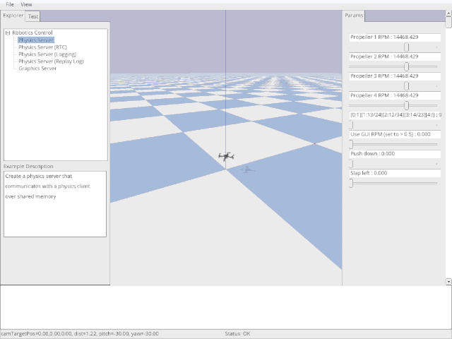
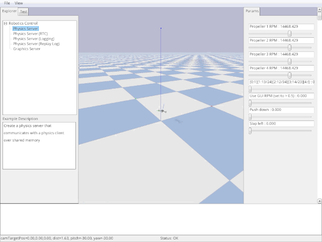
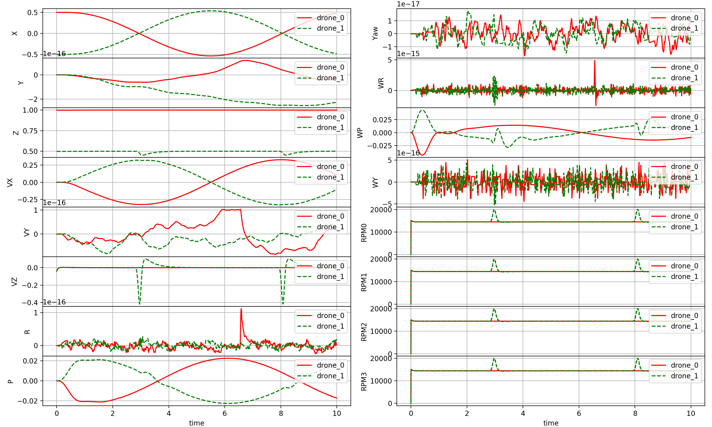
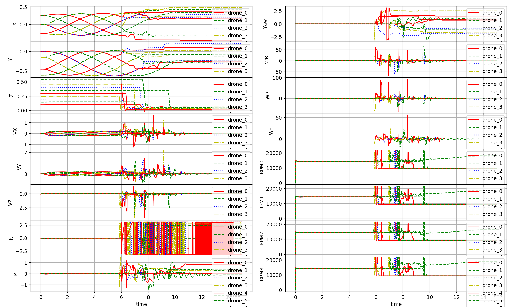

# gym-pybullet-drones

[Simple](https://en.wikipedia.org/wiki/KISS_principle) OpenAI [Gym environment](https://gym.openai.com/envs/#classic_control) based on [PyBullet](https://github.com/bulletphysics/bullet3) for multi-agent reinforcement learning with quadrotors 

 

- The default `DroneModel.CF2X` dynamics are based on [Bitcraze's Crazyflie 2.x nano-quadrotor](https://www.bitcraze.io/documentation/hardware/crazyflie_2_1/crazyflie_2_1-datasheet.pdf)

- Everything after a `$` is entered on a terminal, everything after `>>>` is passed to a Python interpreter

- Suggestions and corrections are very welcome in the form of [issues](https://github.com/JacopoPan/gym-pybullet-drones/issues) and [pull requests](https://github.com/JacopoPan/gym-pybullet-drones/pulls), respectively


## Overview

|                                   | `gym-pybullet-drones` | [AirSim](https://github.com/microsoft/AirSim) | [Flightmare](https://github.com/uzh-rpg/flightmare) |
|---------------------------------: | :-------------------: | :-------------------------------------------: | :-------------------------------------------------: |
|                         *Physics* | PyBullet              | FastPhysicsEngine/PhysX                       | *Ad hoc*/Gazebo                                     |
|                       *Rendering* | PyBullet              | Unreal Engine 4                               | Unity                                               |
|                        *Language* | Python                | C++/C#                                        | C++/Python                                          |  
|           *RGB/Depth/Segm. views* | **Yes**               | **Yes**                                       | **Yes**                                             |
|             *Multi-agent control* | **Yes**               | **Yes**                                       | **Yes**                                             |
|                   *ROS interface* | ROS2/Python           | ROS/C++                                       | ROS/C++                                             |
|            *Hardware-In-The-Loop* | No                    | **Yes**                                       | No                                                  |
|         *Fully steppable physics* | **Yes**               | No                                            | **Yes**                                             |
|             *Aerodynamic effects* | Drag, downwash, ground| Drag                                          | Drag                                                |
|          *OpenAI [`Gym`](https://github.com/openai/gym/blob/master/gym/core.py) interface* | **Yes** | No | **Yes**                                             |
| *RLlib [`MultiAgentEnv`](https://github.com/ray-project/ray/blob/master/rllib/env/multi_agent_env.py) interface* | **Yes** | No | No                           |
| *[PyMARL](https://github.com/oxwhirl/pymarl) integration* | *WIP*  | No                                   | No                                   |


## Performance
Simulation **speed-up with respect to the wall-clock** when using
- *240Hz* (in simulation clock) PyBullet physics for **EACH** drone
- **AND** *48Hz* (in simulation clock) PID control of **EACH** drone
- **AND** nearby *obstacles* **AND** a mildly complex *background* (see GIFs)
- **AND** *24FPS* (in sim. clock), *64x48 pixel* capture of *6 channels* (RGBA, depth, segm.) on **EACH** drone

|                                   | Lenovo P52 (i7-8850H/Quadro P2000) | 2020 MacBook Pro (i7-1068NG7) |
| --------------------------------: | :--------------------------------: | :---------------------------: |
| Rendering                         | OpenGL                             | CPU-based TinyRenderer        | 
| Single drone, **no** vision       | 15.5x                              | 16.8x                         |
| Single drone **with** vision      | 10.8x                              | 1.3x                          |
| Multi-drone (10), **no** vision   | 2.1x                               | 2.3x                          |
| Multi-drone (5) **with** vision   | 2.5x                               | 0.2x                          |
| 80 drones in 4 env, **no** vision | 0.8x                               | 0.95x                         |

> **Note: use `gui=False` and `aggregate_phy_steps=int(SIM_HZ/CTRL_HZ)` for better performance**

> While it is easy to—consciously or not—[cherry pick](https://en.wikipedia.org/wiki/Cherry_picking) statistics, \~5kHz PyBullet physics (CPU-only) is faster than [AirSim (1kHz)](https://arxiv.org/pdf/1705.05065.pdf) and more accurate than [Flightmare's 35kHz simple single quadcopter dynamics](https://arxiv.org/pdf/2009.00563.pdf)

> Exploiting parallel computation—i.e., multiple (80) drones in multiple (4) environments (see script [`parallelism.sh`](https://github.com/JacopoPan/gym-pybullet-drones/blob/master/experiments/performance/parallelism.sh))—achieves PyBullet physics updates at \~20kHz 

> Multi-agent 6-ch. video capture at \~750kB/s with CPU rendering (`(64*48)*(4+4+2)*24*5*0.2`) is comparable to [Flightmare's 240 RGB frames/s](https://arxiv.org/pdf/2009.00563.pdf) (`(32*32)*3*240`)—although in more complex [Unity environments](https://arxiv.org/pdf/2009.00563.pdf)—and up to an order of magnitude faster on Ubuntu, with OpenGL rendering


## Requirements and Installation
The repo was written using *Python 3.7* with [`conda`](https://github.com/JacopoPan/a-minimalist-guide#install-conda) on *macOS 10.15* and tested on *macOS 11*, *Ubuntu 18.04*


### On *macOS* and *Ubuntu*
Major dependencies are [`gym`](https://gym.openai.com/docs/),  [`pybullet`](https://docs.google.com/document/d/10sXEhzFRSnvFcl3XxNGhnD4N2SedqwdAvK3dsihxVUA/edit#), 
[`stable-baselines3`](https://stable-baselines3.readthedocs.io/en/master/guide/quickstart.html), and [`rllib`](https://docs.ray.io/en/master/rllib.html)

> Note: if your default `python` is 2.7, in the following, replace `pip` with `pip3` and `python` with `python3`

```
pip install --upgrade numpy Pillow matplotlib cycler 
pip install --upgrade gym pybullet stable_baselines3 'ray[rllib]'
```
Video recording requires to have [`ffmpeg`](https://ffmpeg.org) installed, on *macOS*
```
$ brew install ffmpeg
```
On *Ubuntu*
```
$ sudo apt install ffmpeg
```
The repo is structured as a [Gym Environment](https://github.com/openai/gym/blob/master/docs/creating-environments.md)
and can be installed with `pip install --editable`
```
$ git clone https://github.com/JacopoPan/gym-pybullet-drones.git
$ cd gym-pybullet-drones/
$ pip install -e .
```


### On *Windows*
Check out these step-by-step [instructions](https://github.com/JacopoPan/gym-pybullet-drones/tree/master/assignments#on-windows) written by Karime Pereida for *Windows 10*


## Examples
There are 2 basic template scripts in `examples/`: `fly.py` and `learn.py`

- `fly.py` runs an independent flight **using PID control** implemented in class [`DSLPIDControl`](https://github.com/JacopoPan/gym-pybullet-drones/tree/master/gym_pybullet_drones/control/DSLPIDControl.py)
```
$ cd gym-pybullet-drones/examples/
$ python fly.py                             # Try 'python fly.py -h' to show the script's customizable parameters
```
> Tip: use the GUI's sliders and button `Use GUI RPM` to override the control with interactive inputs

 

 

- `learn.py` is an **RL example** to learn take-off using `stable-baselines3`'s [A2C](https://stable-baselines3.readthedocs.io/en/master/modules/a2c.html) or `rllib`'s [PPO](https://docs.ray.io/en/master/rllib-algorithms.html#ppo)
```
$ cd gym-pybullet-drones/examples/
$ python learn.py                           # Try 'python learn.py -h' to show the script's customizable parameters
```
 
 

Other scripts in folder `examples/` are:

- `downwash.py` is a flight script with only 2 drones, to test the downwash model
```
$ cd gym-pybullet-drones/examples/
$ python downwash.py                        # Try 'python downwash.py -h' to show the script's customizable parameters
```

 

- `compare.py` which replays and compare to a trace saved in [`example_trace.pkl`](https://github.com/JacopoPan/gym-pybullet-drones/tree/master/files/example_trace.pkl)
```
$ cd gym-pybullet-drones/examples/
$ python compare.py                         # Try 'python compare.py -h' to show the script's customizable parameters
```
 


## Experiments
Folder [`experiments/learning`](https://github.com/JacopoPan/gym-pybullet-drones/tree/master/experiments/learning) contains scripts with template learning pipelines

For single agent RL problems, using [`stable-baselines3`](https://stable-baselines3.readthedocs.io/en/master/guide/quickstart.html), run the [training script](https://github.com/JacopoPan/gym-pybullet-drones/blob/master/experiments/learning/singleagent.py) as
```
$ cd gym-pybullet-drones/experiments/learning/
$ python singleagent.py --env <env> --algo <alg> --obs <ObservationType> --act <ActionType> --cpu <cpu_num>
```
Run the [replay script](https://github.com/JacopoPan/gym-pybullet-drones/blob/master/experiments/learning/test_singleagent.py) to visualize the best trained agent(s) as
```
$ python test_singleagent.py --exp ./results/save-<env>-<algo>-<obs>-<act>-<time-date>
```
For multi-agent RL problems, using [`rllib`](https://docs.ray.io/en/master/rllib.html) run the [train script](https://github.com/JacopoPan/gym-pybullet-drones/blob/master/experiments/learning/multiagent.py) as
```
$ cd gym-pybullet-drones/experiments/learning/
$ python multiagent.py --num_drones <num_drones> --env <env> --obs <ObservationType> --act <ActionType> --algo <alg> --num_workers <num_workers>
```
Run the [replay script](https://github.com/JacopoPan/gym-pybullet-drones/blob/master/experiments/learning/test_multiagent.py) to visualize the best trained agent(s) as
```
$ python test_multiagent.py --exp ./results/save-<env>-<num_drones>-<algo>-<obs>-<act>-<date>
```


## BaseAviary
A flight arena for one (ore more) quadrotor can be created as a subclass of `BaseAviary()`
```
>>> env = BaseAviary( 
>>>       drone_model=DroneModel.CF2X,      # See DroneModel Enum class for other quadcopter models 
>>>       num_drones=1,                     # Number of drones 
>>>       neighbourhood_radius=np.inf,      # Distance at which drones are considered neighbors, only used for multiple drones 
>>>       initial_xyzs=None,                # Initial XYZ positions of the drones
>>>       initial_rpys=None,                # Initial roll, pitch, and yaw of the drones in radians 
>>>       physics: Physics=Physics.PYB,     # Choice of (PyBullet) physics implementation 
>>>       freq=240,                         # Stepping frequency of the simulation
>>>       aggregate_phy_steps=1,            # Number of physics updates within each call to BaseAviary.step()
>>>       gui=True,                         # Whether to display PyBullet's GUI, only use this for debbuging
>>>       record=False,                     # Whether to save a .mp4 video (if gui=True) or .png frames (if gui=False) in gym-pybullet-drones/files/, see script /files/ffmpeg_png2mp4.sh for encoding
>>>       obstacles=False,                  # Whether to add obstacles to the environment
>>>       user_debug_gui=True)              # Whether to use addUserDebugLine and addUserDebugParameter calls (it can slow down the GUI)
````
And instantiated with `gym.make()`—see [`learn.py`](https://github.com/JacopoPan/gym-pybullet-drones/blob/master/examples/learn.py) for an example
```
>>> env = gym.make('rl-takeoff-aviary-v0')  # See learn.py
```
Then, the environment can be stepped with
```
>>> obs = env.reset()
>>> for _ in range(10*240):
>>>     obs, reward, done, info = env.step(env.action_space.sample())
>>>     env.render()
>>>     if done: obs = env.reset()
>>> env.close()
```


### Creating New Aviaries
A new RL problem can be created as a subclass of [`BaseAviary`](https://github.com/JacopoPan/gym-pybullet-drones/blob/master/gym_pybullet_drones/envs/BaseAviary.py) (i.e. `class NewAviary(BaseAviary): ...`) and implementing the following 7 abstract methods
```
>>> #### 1
>>> def _actionSpace(self):
>>>     # e.g. return spaces.Box(low=np.zeros(4), high=np.ones(4), dtype=np.float32)
>>> #### 2
>>> def _observationSpace(self):
>>>     # e.g. return spaces.Box(low=np.zeros(20), high=np.ones(20), dtype=np.float32)
>>> #### 3
>>> def _computeObs(self):
>>>     # e.g. return self._getDroneStateVector(0)
>>> #### 4
>>> def _preprocessAction(self, action):
>>>     # e.g. return np.clip(action, 0, 1)
>>> #### 5
>>> def _computeReward(self):
>>>     # e.g. return -1
>>> #### 6
>>> def _computeDone(self):
>>>     # e.g. return False
>>> #### 7
>>> def _computeInfo(self):
>>>     # e.g. return {"answer": 42}        # Calculated by the Deep Thought supercomputer in 7.5M years
```
See [`CtrlAviary`](https://github.com/JacopoPan/gym-pybullet-drones/blob/master/gym_pybullet_drones/envs/CtrlAviary.py), [`VisionAviary`](https://github.com/JacopoPan/gym-pybullet-drones/blob/master/gym_pybullet_drones/envs/VisionAviary.py), [`HoverAviary`](https://github.com/JacopoPan/gym-pybullet-drones/blob/master/gym_pybullet_drones/envs/single_agent_rl/HoverAviary.py), and [`FlockAviary`](https://github.com/JacopoPan/gym-pybullet-drones/blob/master/gym_pybullet_drones/envs/multi_agent_rl/FlockAviary.py) for examples


### Action Spaces Examples
The action space's definition of an environment must be implemented in each subclass of [`BaseAviary`](https://github.com/JacopoPan/gym-pybullet-drones/blob/master/gym_pybullet_drones/envs/BaseAviary.py) by function
```
>>> def _actionSpace(self):
>>>     ...
```
In [`CtrlAviary`](https://github.com/JacopoPan/gym-pybullet-drones/blob/master/gym_pybullet_drones/envs/CtrlAviary.py) and [`VisionAviary`](https://github.com/JacopoPan/gym-pybullet-drones/blob/master/gym_pybullet_drones/envs/VisionAviary.py), it is a [`Dict()`](https://github.com/openai/gym/blob/master/gym/spaces/dict.py) of [`Box(4,)`](https://github.com/openai/gym/blob/master/gym/spaces/box.py) containing the drones' commanded RPMs

The dictionary's keys are `"0"`, `"1"`, .., `"n"`—where `n` is the number of drones

Each subclass of [`BaseAviary`](https://github.com/JacopoPan/gym-pybullet-drones/blob/master/gym_pybullet_drones/envs/BaseAviary.py) also needs to implement a preprocessing step translating actions into RPMs
```
>>> def _preprocessAction(self, action):
>>>     ...
```
[`CtrlAviary`](https://github.com/JacopoPan/gym-pybullet-drones/blob/master/gym_pybullet_drones/envs/CtrlAviary.py), [`VisionAviary`](https://github.com/JacopoPan/gym-pybullet-drones/blob/master/gym_pybullet_drones/envs/VisionAviary.py), [`HoverAviary`](https://github.com/JacopoPan/gym-pybullet-drones/blob/master/gym_pybullet_drones/envs/single_agent_rl/HoverAviary.py), and [`FlockAviary`](https://github.com/JacopoPan/gym-pybullet-drones/blob/master/gym_pybullet_drones/envs/multi_agent_rl/FlockAviary.py) all simply clip the inputs to `MAX_RPM`

[`DynAviary`](https://github.com/JacopoPan/gym-pybullet-drones/blob/master/gym_pybullet_drones/envs/DynAviary.py)'s `action` input to `DynAviary.step()` is a [`Dict()`](https://github.com/openai/gym/blob/master/gym/spaces/dict.py) of [`Box(4,)`](https://github.com/openai/gym/blob/master/gym/spaces/box.py) containing
- The desired thrust along the drone's z-axis
- The desired torque around the drone's x-axis
- The desired torque around the drone's y-axis
- The desired torque around the drone's z-axis

From these, desired RPMs are computed by [`DynAviary._preprocessAction()`](https://github.com/JacopoPan/gym-pybullet-drones/blob/master/gym_pybullet_drones/envs/DynAviary.py)


### Observation Spaces Examples
The observation space's definition of an environment must be implemented by every subclass of [`BaseAviary`](https://github.com/JacopoPan/gym-pybullet-drones/blob/master/gym_pybullet_drones/envs/BaseAviary.py)
```
>>> def _observationSpace(self):
>>>     ...
```
In [`CtrlAviary`](https://github.com/JacopoPan/gym-pybullet-drones/blob/master/gym_pybullet_drones/envs/CtrlAviary.py), it is a [`Dict()`](https://github.com/openai/gym/blob/master/gym/spaces/dict.py) of pairs `{"state": Box(20,), "neighbors": MultiBinary(num_drones)}`

The dictionary's keys are `"0"`, `"1"`, .., `"n"`—where `n` is the number of drones

Each [`Box(20,)`](https://github.com/openai/gym/blob/master/gym/spaces/box.py) contains the drone's
- X, Y, Z position in `WORLD_FRAME` (in meters, 3 values)
- Quaternion orientation in `WORLD_FRAME` (4 values)
- Roll, pitch and yaw angles in `WORLD_FRAME` (in radians, 3 values)
- The velocity vector in `WORLD_FRAME` (in m/s, 3 values)
- Angular velocities in `WORLD_FRAME` (in rad/s, 3 values)
- Motors' speeds (in RPMs, 4 values)

Each [`MultiBinary(num_drones)`](https://github.com/openai/gym/blob/master/gym/spaces/multi_binary.py) contains the drone's own row of the multi-robot system [adjacency matrix](https://en.wikipedia.org/wiki/Adjacency_matrix)

The observation space of [`VisionAviary`](https://github.com/JacopoPan/gym-pybullet-drones/blob/master/gym_pybullet_drones/envs/VisionAviary.py) is the same as[`CtrlAviary`](https://github.com/JacopoPan/gym-pybullet-drones/blob/master/gym_pybullet_drones/envs/CtrlAviary.py) but also includes keys `rgb`, `dep`, and `seg` (in each drone's dictionary) for the matrices containing the drone's RGB, depth, and segmentation views

To fill/customize the content of `obs`, every subclass of [`BaseAviary`](https://github.com/JacopoPan/gym-pybullet-drones/blob/master/gym_pybullet_drones/envs/BaseAviary.py) needs to implement
```
>>> def _computeObs(self, action):
>>>     ...
```
See [`BaseAviary._exportImage()`](https://github.com/JacopoPan/gym-pybullet-drones/blob/master/gym_pybullet_drones/envs/BaseAviary.py)) and its use in [`VisionAviary._computeObs()`](https://github.com/JacopoPan/gym-pybullet-drones/blob/master/gym_pybullet_drones/envs/VisionAviary.py) to save frames as PNGs


### Obstacles
Objects can be added to an environment using [`loadURDF` (or `loadSDF`, `loadMJCF`)](https://docs.google.com/document/d/10sXEhzFRSnvFcl3XxNGhnD4N2SedqwdAvK3dsihxVUA/edit#heading=h.sbnykoneq1me) in method `_addObstacles()`
```
>>> def _addObstacles(self):
>>>     ...
>>>     p.loadURDF("sphere2.urdf", [0,0,0], p.getQuaternionFromEuler([0,0,0]), physicsClientId=self.CLIENT)
```


### Drag, Ground Effect, and Downwash Models
Simple drag, ground effect, and downwash models can be included in the simulation initializing `BaseAviary()` with `physics=Physics.PYB_GND_DRAG_DW`, these are based on the system identification of [Forster (2015)](http://mikehamer.info/assets/papers/Crazyflie%20Modelling.pdf) (Eq. 4.2), the analytical model used as a baseline for comparison by [Shi et al. (2019)](https://arxiv.org/pdf/1811.08027.pdf) (Eq. 15), and [DSL](https://www.dynsyslab.org/vision-news/)'s experimental work

Check the implementations of `_drag()`, `_groundEffect()`, and `_downwash()` in [`BaseAviary`](https://github.com/JacopoPan/gym-pybullet-drones/blob/master/gym_pybullet_drones/envs/BaseAviary.py) for more detail


## On-board RGB, Depth, and Segmentation Views

  


## Control
Folder [`control`](https://github.com/JacopoPan/gym-pybullet-drones/blob/master/gym_pybullet_drones/control/) contains the implementations of 2 PID controllers

[`DSLPIDControl`](https://github.com/JacopoPan/gym-pybullet-drones/blob/master/gym_pybullet_drones/control/DSLPIDControl.py) (for `DroneModel.CF2X/P`) and [`SimplePIDControl`](https://github.com/JacopoPan/gym-pybullet-drones/blob/master/gym_pybullet_drones/control/SimplePIDControl.py) (for `DroneModel.HB`) can be used as
```   
>>> ctrl = [DSLPIDControl(env) for i in range(num_drones)]                          # Initialize "num_drones" controllers
>>> ...
>>> for i in range(num_drones):                                                     # Compute control for each drone
>>>     action[str(i)], _, _ = ctrl[i].computeControlFromState(.                    # Write the action in a dictionary
>>>                                    control_timestep=env.TIMESTEP,
>>>                                    state=obs[str(i)]["state"],
>>>                                    target_pos=TARGET_POS)
```


## Logger
Class [`Logger`](https://github.com/JacopoPan/gym-pybullet-drones/blob/master/gym_pybullet_drones/utils/Logger.py) contains helper functions to save and plot simulation data, as in this example
```
>>> logger = Logger(logging_freq_hz=freq, num_drones=num_drones)                    # Initialize the logger
>>> ...
>>> for i in range(NUM_DRONES):             # Log information for each drone
>>>     logger.log(drone=i,
>>>                timestamp=K/env.SIM_FREQ,
>>>                state= obs[str(i)]["state"],
>>>                control=np.hstack([ TARGET_POS, np.zeros(9) ]))   
>>> ...
>>> logger.save()                           # Save data to file
>>> logger.plot()                           # Plot data
```


## ROS2 Python Wrapper
Workspace [`ros2`](https://github.com/JacopoPan/gym-pybullet-drones/tree/master/ros2) contains two [ROS2 Foxy Fitzroy](https://index.ros.org/doc/ros2/Installation/Foxy/) Python nodes
- [`AviaryWrapper`](https://github.com/JacopoPan/gym-pybullet-drones/blob/master/ros2/src/ros2_gym_pybullet_drones/ros2_gym_pybullet_drones/aviary_wrapper.py) is a wrapper node for a single-drone [`CtrlAviary`](https://github.com/JacopoPan/gym-pybullet-drones/blob/master/gym_pybullet_drones/envs/CtrlAviary.py) environment
- [`RandomControl`](https://github.com/JacopoPan/gym-pybullet-drones/blob/master/ros2/src/ros2_gym_pybullet_drones/ros2_gym_pybullet_drones/random_control.py) reads `AviaryWrapper`'s `obs` topic and publishes random RPMs on topic `action`

### Use
With ROS2 installed (on either macOS or Ubuntu, edit `ros2_and_pkg_setups.(zsh/bash)` accordingly), run
```
$ cd gym-pybullet-drones/ros2/
$ source ros2_and_pkg_setups.zsh            # On macOS, on Ubuntu use $ source ros2_and_pkg_setups.bash
$ colcon build --packages-select ros2_gym_pybullet_drones
$ source ros2_and_pkg_setups.zsh            # On macOS, on Ubuntu use $ source ros2_and_pkg_setups.bash
$ ros2 run ros2_gym_pybullet_drones aviary_wrapper
```
In a new terminal terminal, run
```
$ cd gym-pybullet-drones/ros2/
$ source ros2_and_pkg_setups.zsh            # On macOS, on Ubuntu use $ source ros2_and_pkg_setups.bash
$ ros2 run ros2_gym_pybullet_drones random_control
```


## Citation
If you wish, please cite this work as
```
@MISC{gym-pybullet-drones2020,
    author = {Panerati, Jacopo and Zheng, Hehui and Zhou, SiQi and Xu, James and Prorok, Amanda and Sch\"{o}llig, Angela P.},
    title = {Learning to Fly: a PyBullet-based Gym environment to simulate and learn the control of multiple nano-quadcopters},
    howpublished = {\url{https://github.com/JacopoPan/gym-pybullet-drones}},
    year = {2020}
}
```


## References
- Nathan Michael, Daniel Mellinger, Quentin Lindsey, Vijay Kumar (2010) [*The GRASP Multiple Micro UAV Testbed*](http://citeseerx.ist.psu.edu/viewdoc/download?doi=10.1.1.169.1687&rep=rep1&type=pdf)
- Benoit Landry (2014) [*Planning and Control for Quadrotor Flight through Cluttered Environments*](http://groups.csail.mit.edu/robotics-center/public_papers/Landry15)
- Julian Forster (2015) [*System Identification of the Crazyflie 2.0 Nano Quadrocopter*](http://mikehamer.info/assets/papers/Crazyflie%20Modelling.pdf)
- Carlos Luis and Jeroome Le Ny (2016) [*Design of a Trajectory Tracking Controller for a Nanoquadcopter*](https://arxiv.org/pdf/1608.05786.pdf)
- Shital Shah, Debadeepta Dey, Chris Lovett, and Ashish Kapoor (2017) [*AirSim: High-Fidelity Visual and Physical Simulation for Autonomous Vehicles*](https://arxiv.org/pdf/1705.05065.pdf)
- Guanya Shi, Xichen Shi, Michael O’Connell, Rose Yu, Kamyar Azizzadenesheli, Animashree Anandkumar, Yisong Yue, and Soon-Jo Chung (2019)
[*Neural Lander: Stable Drone Landing Control Using Learned Dynamics*](https://arxiv.org/pdf/1811.08027.pdf)
- Yunlong Song, Selim Naji, Elia Kaufmann, Antonio Loquercio, and Davide Scaramuzza (2020) [*Flightmare: A Flexible Quadrotor Simulator*](https://arxiv.org/pdf/2009.00563.pdf)
- C. Karen Liu and Dan Negrut (2020) [*The Role of Physics-Based Simulators in Robotics*](https://www.annualreviews.org/doi/pdf/10.1146/annurev-control-072220-093055)
- Aaqib Parvez Mohammed and Matias Valdenegro-Toro (2020) [*Can Reinforcement Learning for Continuous Control Generalize Across Physics Engines?*](https://arxiv.org/pdf/2010.14444.pdf)
- Eric Liang, Richard Liaw, Philipp Moritz, Robert Nishihara, Roy Fox, Ken Goldberg, Joseph E. Gonzalez, Michael I. Jordan, and Ion Stoica (2018) [*RLlib: Abstractions for Distributed Reinforcement Learning*](https://arxiv.org/pdf/1712.09381.pdf)
- Antonin Raffin, Ashley Hill, Maximilian Ernestus, Adam Gleave, Anssi Kanervisto, and Noah Dormann (2019) [*Stable Baselines3*](https://github.com/DLR-RM/stable-baselines3)
- Mikayel Samvelyan, Tabish Rashid, Christian Schroeder de Witt, Gregory Farquhar, Nantas Nardelli, Tim G. J. Rudner, Chia-Man Hung, Philip H. S. Torr, Jakob Foerster, and Shimon Whiteson (2019) [*The StarCraft Multi-Agent Challenge*](https://arxiv.org/pdf/1902.04043.pdf)


## Bonus GIF for Scrolling this Far

 


-----

> University of Toronto's [Dynamic Systems Lab](https://github.com/utiasDSL) / [Vector Institute](https://github.com/VectorInstitute) / University of Cambridge's [Prorok Lab](https://github.com/proroklab) / [Mitacs](https://www.mitacs.ca/en/projects/multi-agent-reinforcement-learning-decentralized-uavugv-cooperative-exploration)

