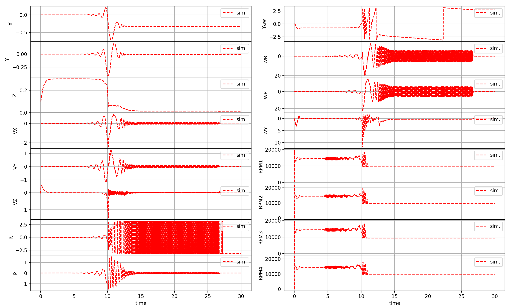

# gym-pybullet-drones
Simple [OpenAI Gym environment](https://gym.openai.com/envs/#classic_control) based on [PyBullet](https://github.com/bulletphysics/bullet3) to simulate one (or more, WIP) quadrotors 

 

Everything after a `$` is entered on a terminal, everything after `>>>` is passed to a Python interpreter


### Requirements
The repo was written using Python 3.7.6 on macOS 10.15: major dependencies are [`gym`](https://gym.openai.com/docs/),  [`pybullet`](https://docs.google.com/document/d/10sXEhzFRSnvFcl3XxNGhnD4N2SedqwdAvK3dsihxVUA/edit#), 
[`stable-baselines3`](https://stable-baselines3.readthedocs.io/en/master/guide/quickstart.html), [`rllib`](https://docs.ray.io/en/master/rllib.html) and [`ffmpeg`](https://ffmpeg.org) (only used for video recording)
```
$ pip install gym
$ pip install pybullet
$ pip install stable-baselines3
$ pip install `ray[rllib]`
$ brew install ffmpeg                    # on macOS
$ sudo apt install ffmpeg                # on Linux
```
With a [`conda` environment](https://github.com/JacopoPan/a-minimalist-guide#install-conda), 
dependencies (except `ffmpeg`), can be installed from file
```
$ cd gym-pybullet-drones/
$ conda create -n myenv --file /gym_pybullet_drones/assets/conda-req-list.txt
```


## Installation
The repo is structured as a [Gym Environment](https://github.com/openai/gym/blob/master/docs/creating-environments.md)
and can be installed with `pip install --editable`
```
$ git clone https://github.com/JacopoPan/gym-pybullet-drones.git
$ cd gym-pybullet-drones/
$ pip install -e .
```


## Use
There are 4 main files in `scripts/`: `run_physics.py`, `run_trace.py`, `run_flight.py`, `run_physics.py`

`run_physics.py` is meant to test PyBullet's forces and torques in `p.WORLD_FRAME` and `p.LINK_FRAME`
```
$ conda activate myenv                   # If using a conda environment
$ cd gym-pybullet-drones/scripts/
$ python run_physics.py                  # Or run_physics_standalone.py
```
`run_trace.py` replays and compare to a trace saved in [`trace.pkl`](https://github.com/JacopoPan/gym-pybullet-drones/blob/master/validation_traces/trace.pkl)
```
$ conda activate myenv                   # If using a conda environment
$ cd gym-pybullet-drones/scripts/
$ python run_trace.py
```
 


`run_flight.py` runs an independent flight **using PID control** implemented in [`control()`](https://github.com/JacopoPan/gym-pybullet-drones/blob/master/gym_pybullet_drones/envs/SingleDroneEnv.py#L504)
```
$ conda activate myenv                   # If using a conda environment
$ cd gym-pybullet-drones/scripts/
$ python run_flight.py
```
 


`run_learning.py` is an **RL example** to learn take-off using `stable-baselines3`'s [A2C](https://stable-baselines3.readthedocs.io/en/master/modules/a2c.html) or `rllib`'s [PPO](https://docs.ray.io/en/master/rllib-algorithms.html#ppo)
```
$ conda activate myenv                   # If using a conda environment
$ cd gym-pybullet-drones/scripts/
$ python run_learning.py
```
 
 


## SingleDroneEnv
A single quadrotor enviroment can be created with
```
>>> env = SingleDroneEnv(drone_model=DroneModel.CF2X, \    # See DroneModel.py for other quadcopter models (remove this comment)
>>>            pybullet=True, \                            # Whether to use PyBullet physics or the dynamics in method _noPyBulletDynamics() (remove this comment)
>>>            normalized_spaces=True, \                   # Whether to use normalized action and observation spaces—use True for learning (default), False for simulation (remove this comment)
>>>            freq=240, \                                 # The stepping frequency of the simulation (remove this comment)
>>>            gui=True, \                                 # Whether to display PyBullet's GUI (remove this comment)
>>>            obstacles=False, \                          # Whether to add obstacles to the environment (remove this comment)
>>>            record=False)                               # Whether to save a .mp4 video in gym-pybullet-drones/ (remove this comment)
>>>                                                        # See run_flight.py for an example
````
Or using
```
>>> env = gym.make('single-drone-v0')                      # See run_learning_test.py
```
Then, the environment can be stepped with
```
>>> obs = env.reset()
>>> for _ in range(10*240):
>>>     obs, reward, done, info = env.step(env.action_space.sample())
>>>     env.render()
>>>     if done: obs = env.reset()
>>> env.close()
```


### Action Space
The action space is a [`Box(4,)`](https://github.com/openai/gym/blob/master/gym/spaces/box.py) containing the desired rotation speed of each motor, if `normalized_spaces=True`, they range from -1 to 1, if `False` from 0 to `SingleDroneEnv.MAX_RPM`

### Observation Space
The observation space is a [`Box(20,)`](https://github.com/openai/gym/blob/master/gym/spaces/box.py) containing the drone's
- XYZ position
- Quaternion pose
- Roll, Pitch and Yaw angles
- Velocity
- Angular velocity 
- Motors' speeds

Check [`_clipAndNormalizeState()`](https://github.com/JacopoPan/gym-pybullet-drones/blob/master/gym_pybullet_drones/envs/SingleDroneEnv.py#L406) for the mapping from raw simulation data to normalized observations in the [-1,1] range (i.e., when using `normalized_spaces=False`)

### Reward
The reward function can/should be modified in [`_computeReward()`](https://github.com/JacopoPan/gym-pybullet-drones/blob/master/gym_pybullet_drones/envs/SingleDroneEnv.py#L435), for example
```
>>> def _computeReward(self, state):
>>>     height = state[2]
>>>     if height > 0.5: return 1000
>>>     elif height > 0.1: return 100
>>>     else: return -1
```

### Done
The halting conditions can/should be modified in [`_isDone()`](https://github.com/JacopoPan/gym-pybullet-drones/blob/master/gym_pybullet_drones/envs/SingleDroneEnv.py#L459), for example
```
>>> def _isDone(self, state):
>>>     x = state[0]; y = state[1]; z = state[2] 
>>>     roll = state[7]; pitch = state[8]
>>>     if np.abs(x)>.5 or np.abs(y)>.5 or z>=1 \
>>>             or np.abs(roll)>np.pi/2 or np.abs(pitch)>np.pi/2 \
>>>             or self.step_counter > 5*self.SIM_FREQ: 
>>>         return True
>>>     else: 
>>>         return False
```


## MultiDroneEnv
WIP
### Actions
...
### Observation Space
...
### Reward
...
### Done
...


## Drag, Ground Effect, and Downwash Models
WIP


## References
- Nathan Michael, Daniel Mellinger, Quentin Lindsey, Vijay Kumar (2010) [*The GRASP Multiple Micro UAV Testbed*](http://citeseerx.ist.psu.edu/viewdoc/download?doi=10.1.1.169.1687&rep=rep1&type=pdf)
- Benoit Landry (2014) [*Planning and Control for Quadrotor Flight through Cluttered Environments*](http://groups.csail.mit.edu/robotics-center/public_papers/Landry15)
- Julian Forster (2015) [*System Identification of the Crazyflie 2.0 Nano Quadrocopter*](http://mikehamer.info/assets/papers/Crazyflie%20Modelling.pdf)
- Carlos Luis and Jeroome Le Ny (2016) [*Design of a Trajectory Tracking Controller for a Nanoquadcopter*](https://arxiv.org/pdf/1608.05786.pdf)


-----

University of Toronto's [Dynamic Systems Lab](https://github.com/utiasDSL) ——— [Vector Institute](https://github.com/VectorInstitute) ——— University of Cambridge's [Prorok Lab](https://github.com/proroklab)
