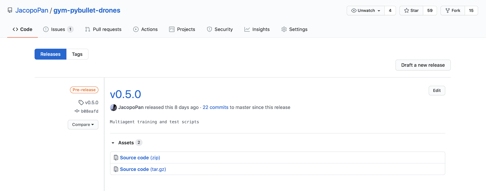
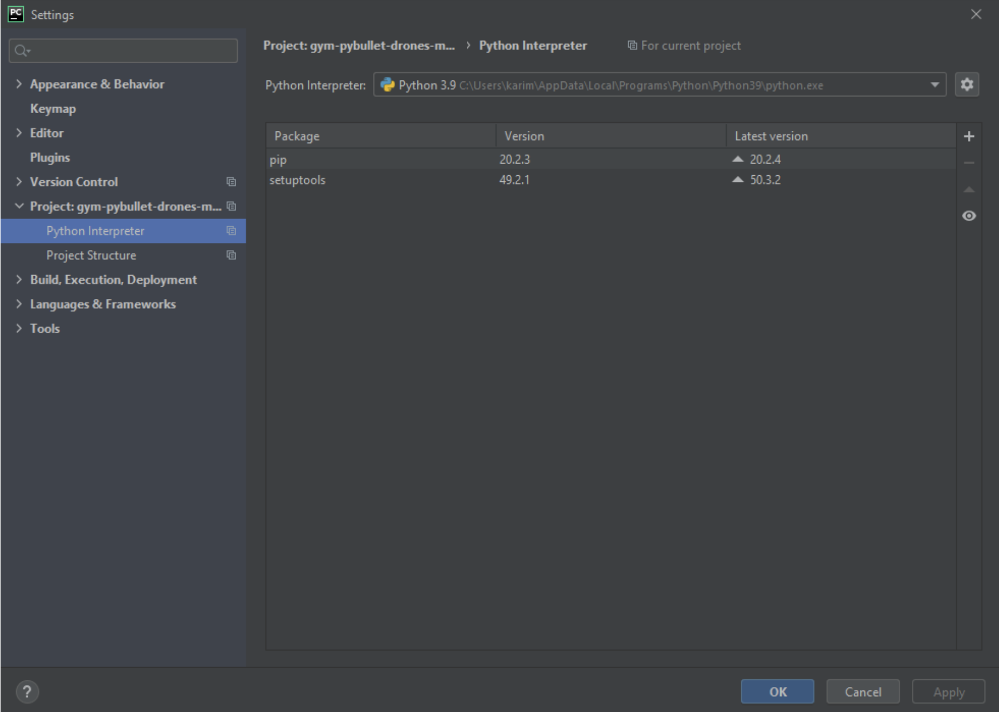
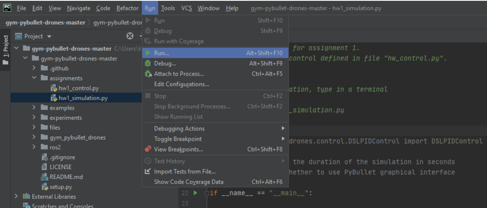

# AER1216 Fall 2020
Quadcopter control exercises for University of Toronto's Fall 2020 course *AER1216: Fundamentals of Unmanned Aerial Vehicles*

## On Ubuntu or macOS

The repo was written using *Python 3.7* with [`conda`](https://github.com/JacopoPan/a-minimalist-guide#install-conda) on *macOS 10.15* and tested on *macOS 11*, *Ubuntu 18.04*

> Note: if your default `python` is 2.7, in the following, replace `pip` with `pip3` and `python` with `python3`

### Requirements
In a terminal, type
```
pip install --upgrade numpy Pillow matplotlib cycler 
pip install --upgrade gym pybullet stable_baselines3 'ray[rllib]'
```
On *macOS*
```
$ brew install ffmpeg
```
On *Ubuntu*
```
$ sudo apt install ffmpeg
```

### Installation
In a terminal, type
```
$ wget https://github.com/JacopoPan/gym-pybullet-drones/archive/v0.5.1.zip
$ unzip v0.5.1.zip
$ cd gym-pybullet-drones-0.5.1/
$ pip install -e .
```

### Use
In a terminal, type
```
$ cd assignments/
$ python aer1216_fall2020_hw1_sim.py        # e.g., for hw1
```

### Troubleshooting
On Ubuntu and macOS, contact `jacopo.panerati {at} utoronto.ca`

## On Windows

### Requirements

Download Visual Studio and [C++ 14.0](https://visualstudio.microsoft.com/downloads/)
- We recommend the free Community version
- Select "Desktop development with C++"

Download [Python 3](https://www.python.org/downloads/release/python-390/)
- Note: we used the [Windows x86-64 installer](https://www.python.org/ftp/python/3.9.0/python-3.9.0-amd64.exe) on Windows 10 Home

Download a Python IDE
- We recommend [PyCharm Community](https://www.jetbrains.com/pycharm/download/#section=windows)
- Select all the options in the installer and reboot

### Installation

Download the code
- Go to https://github.com/JacopoPan/gym-pybullet-drones/releases
- Under "Releases" -> `v0.5.1`, click on "Assets" and download the source code (zip or tar.gz)



Unzip and open folder `gym-pybullet-drones-v0.5.1` in PyCharm 

Open `aer1216_fall2020_hw1_sim.py` in PyCharm

To run code you may need to configure PyCharm. 
- Go to `File->Settings` and Select `Project:gym-pybullet-drones.py->Python Interpreter`



- Select the `+` 

> Type `numpy` and click "Install package".

> Type `matplotlib` and click "Install package".

> Type `pybullet` and click "Install package".

> Type `gym` and click "Install package".

> Type `Pillow` and click "Install package".

> Type `Cycler` and click "Install package".

### Use

If (as) you did not install the `gym_pybullet_drones` module, uncomment lines 17-18
```
>>> import sys
>>> sys.path.append('../')
```
in file `aer1216_fall2020_hw1_sim.py`

Go to the "Run" drop down menu and select "Run" 



- Select `aer1216_fall2020_hw1_sim.py` to start the simulation

### Troubleshooting
On Windows, contact `karime.pereida {at} robotics.utias.utoronto.ca`
